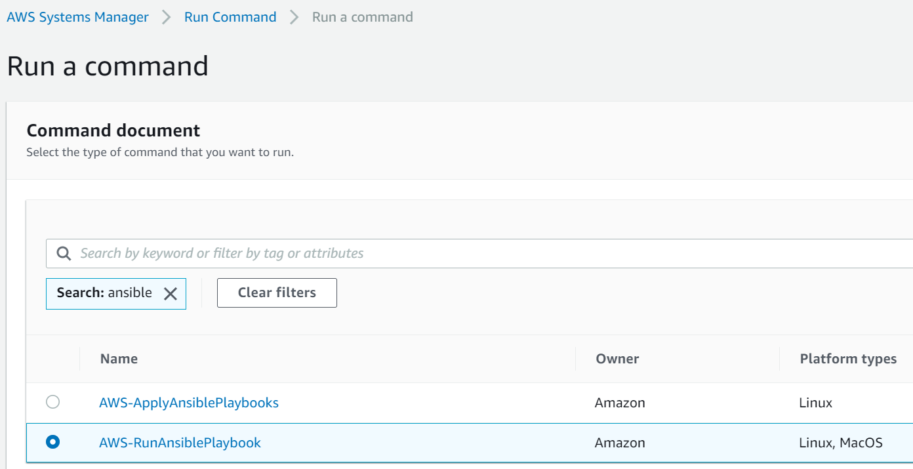
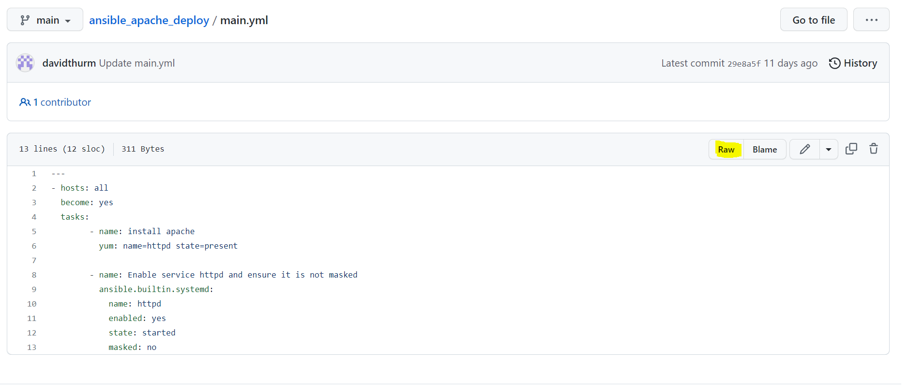
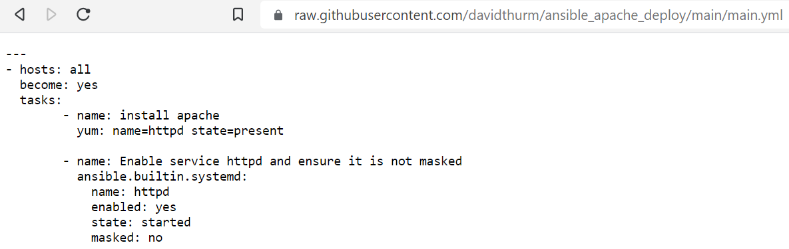
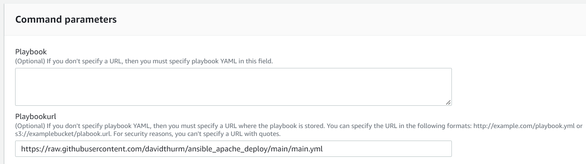
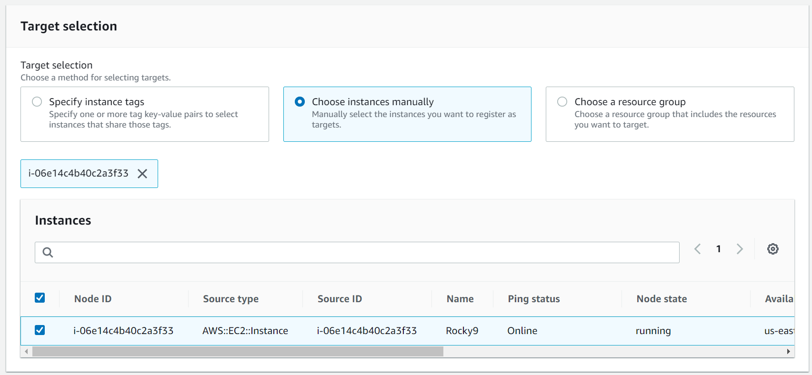
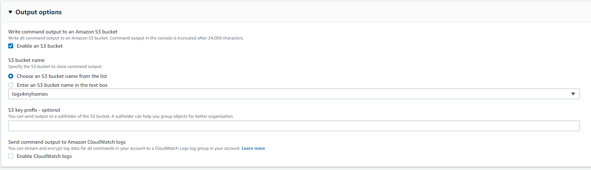

# Run Command


# Command document

Search:
```
ansible
```

### Choose:
```
 AWS-RunAnsiblePlaybook
```
<br />
<br />
<br />

# Jump to your Github Repository
Select "Raw" on the github site to get the correct URL.



<br />
<br />
<br />

# Example Output of Raw File


<br />
<br />
<br />

# Command parameters
## Enter your Raw Github URL in the Playbookurl Field

<br />

Example:
```
https://raw.githubusercontent.com/davidthurm/ansible_apache_deploy/main/main.yml
```
<br />

# Target Selection
Choose your Intances you want to run ansible on.


<br />

# Enabling the S3 Bucket for logging

<br />

# Skip the rest and hit "RUN"